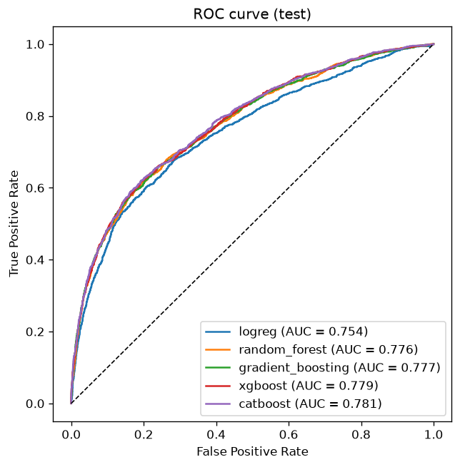
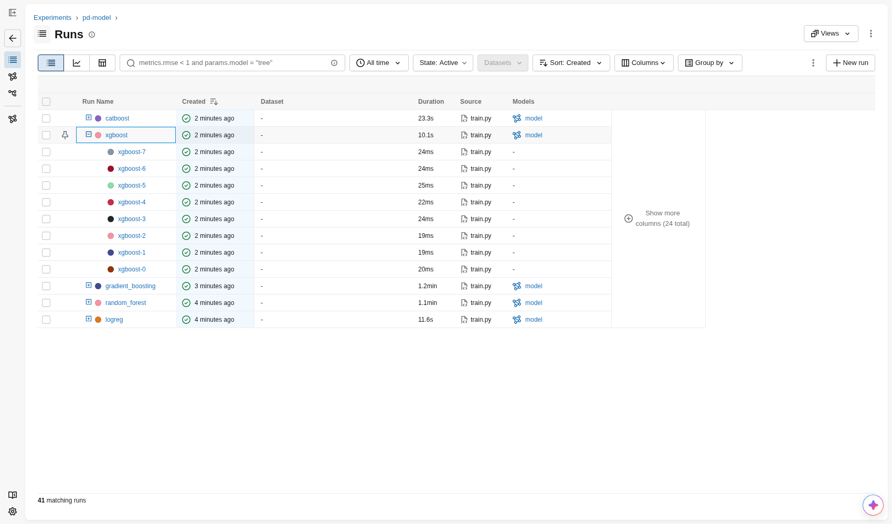
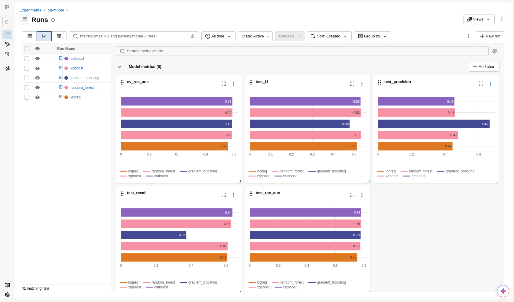
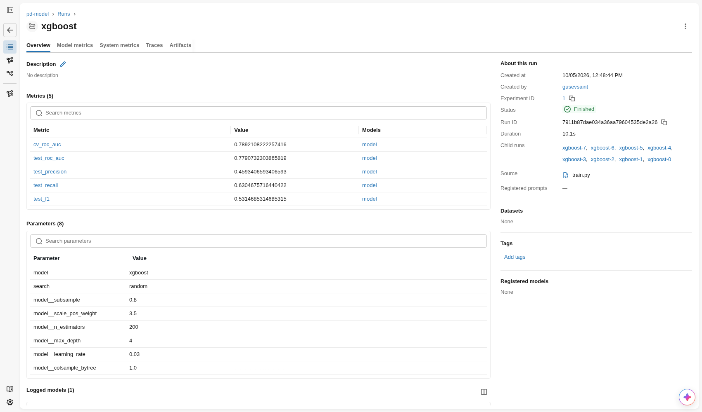
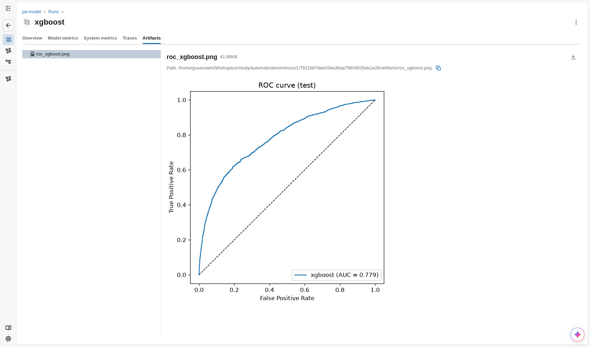

# PD-модель: предсказание дефолта по кредитной карте

Итоговый проект по дисциплине «Автоматизация процессов разработки и тестирования моделей машинного обучения»

Модель оценивает вероятность того, что клиент кредитной карты не внесёт платёж в следующем месяце (probability of default). Большая часть работы ушла на обвязку вокруг модели:

- загрузка и проверка данных через Great Expectations
- feature engineering и sklearn Pipeline с подбором гиперпараметров (logreg, random forest, gradient boosting, XGBoost, CatBoost)
- трекинг экспериментов в MLflow
- версионирование данных и модели через DVC
- CI на GitHub Actions
- REST API на FastAPI в Docker
- мониторинг дрифта через PSI

Данные: [Default of Credit Card Clients](https://www.kaggle.com/datasets/uciml/default-of-credit-card-clients-dataset). 30 000 строк, по описанию это клиенты тайваньского банка за апрель-сентябрь 2005 года (около 7% строк оказались повторными снимками тех же клиентов). 23 признака, таргет `default payment next month`.

## Структура проекта

```
├── .github/workflows/ci.yml   # CI: flake8, black, валидация данных, pytest
├── data/                      # raw/ и processed/, управляются DVC
├── models/                    # model.joblib, управляется DVC
├── notebooks/01_eda.ipynb     # разведочный анализ
├── reports/
│   ├── metrics.json           # метрики лучшей модели (DVC metrics)
│   ├── drift*.json            # результаты мониторинга
│   └── figures/               # ROC-кривая, скриншоты MLflow
├── scripts/
│   ├── build_and_run.sh       # сборка и запуск docker-образа
│   └── example.json           # пример запроса к API
├── src/
│   ├── data/
│   │   ├── download.py        # загрузка датасета с UCI
│   │   ├── validation.py      # набор правил Great Expectations
│   │   └── make_dataset.py    # валидация, очистка, train/test split
│   ├── features/
│   │   └── build_features.py  # новые признаки
│   ├── models/
│   │   ├── pipeline.py        # sklearn Pipeline и модели
│   │   ├── metrics.py         # метрики и ROC-кривая
│   │   └── train.py           # подбор гиперпараметров, MLflow
│   ├── api/app.py             # FastAPI, /predict
│   └── monitoring/drift.py    # имитация трафика и PSI
├── tests/                     # pytest
├── dvc.yaml, dvc.lock         # DVC-пайплайн
├── params.yaml                # параметры сплита и сетки гиперпараметров
├── Dockerfile
├── requirements.txt           # всё для обучения, тестов и разработки
└── requirements-api.txt       # только инференс (ставится в docker-образ)
```

## Запуск

### Окружение

```bash
python3.13 -m venv .venv
source .venv/bin/activate
pip install -r requirements.txt
```

### Пайплайн (DVC)

```bash
dvc repro            # download -> prepare -> train
dvc metrics show     # метрики лучшей модели
dvc dag              # граф стадий
```

Стадии описаны в `dvc.yaml`:

| Стадия | Что делает | Выход |
|---|---|---|
| `download` | скачивает zip, сохраняет CSV | `data/raw/credit.csv` |
| `prepare` | проверяет данные набором GE, чистит, делит 80/20 со стратификацией | `data/processed/{train,test}.csv` |
| `train` | подбор гиперпараметров для пяти моделей, логирование в MLflow, сохранение лучшей | `models/model.joblib`, `reports/metrics.json`, `reports/figures/roc_curve.png` |

Хэши данных и модели лежат в `dvc.lock`, сами файлы в кэше DVC. Remote у меня локальный, для `dvc push` его нужно добавить:

```bash
dvc remote add -d --local localstore ~/dvc-storage
dvc push
```

### MLflow

```bash
mlflow ui --backend-store-uri sqlite:///mlflow.db
```

UI откроется на http://localhost:5000, эксперимент называется `pd-model`.

### Тесты и линтеры

```bash
pytest -v
flake8 src tests
black --check src tests
python -m src.data.validation data/raw/credit.csv   # валидация данных отдельно
```

### Docker и API

```bash
./scripts/build_and_run.sh
```

Скрипт собирает образ `pd-model-api`, запускает контейнер на порту 8000 и отправляет тестовый запрос из `scripts/example.json`. Если модели ещё нет, он сначала запустит `dvc repro`. Swagger доступен на http://localhost:8000/docs.

### Мониторинг дрифта

При запущенном API:

```bash
python -m src.monitoring.drift --n 1000           # обычные данные
python -m src.monitoring.drift --n 1000 --shift   # с искусственным сдвигом
```

## Данные и валидация

Разведочный анализ лежит в `notebooks/01_eda.ipynb`. Что из него пошло в проект:

- пропусков нет, все признаки целочисленные, 35 дубликатов (без учёта ID) я удаляю при очистке
- дефолтов 22%, поэтому основная метрика ROC-AUC, а сплит стратифицированный
- сильнее всего с дефолтом связана история платежей: если в сентябре платёж задержан на два месяца и больше, дефолтов около 70%, у платящих вовремя 13-17%
- описание колонок на Kaggle расходится с данными. Я опирался на ответ автора датасета из [обсуждения на Kaggle](https://www.kaggle.com/datasets/uciml/default-of-credit-card-clients-dataset/discussion/34608): EDUCATION 0, 4, 5, 6 - это others, у MARRIAGE 3 означает divorce, а others - это 0, у `PAY_*` -2 значит, что картой не пользовались, а 0 - внесён минимальный платёж
- статус «задержка на месяц» встречается почти только в сентябре (3688 раз против 28, 4, 2, 0 и 0 в остальных месяцах). При этом 6209 раз после месяца без долга сразу стоит 2, хотя за месяц просрочка вырастает максимум на месяц. Такие переходы есть в каждом месяце, в сентябре тоже, так что первую просрочку, похоже, часто записывали сразу как 2
- около 7% строк - тот же клиент, снятый на месяц раньше или позже (1037 пар). При случайном сплите 346 тестовых строк получили «двойника» в train. Я проверил, влияет ли это на оценку: без них ROC-AUC 0.7798, на всём тесте 0.7791, так что метрики утечка не завышает

Набор правил Great Expectations (`src/data/validation.py`) проверяет сырые данные:

- набор колонок в точности совпадает с ожидаемым;
- нет null, все колонки int64, ID уникален
- диапазоны: `LIMIT_BAL > 0`, `AGE` от 18 до 100, `PAY_*` от -2 до 9, `PAY_AMT* >= 0`
- допустимые значения: `SEX` {1, 2}, `EDUCATION` 0-6, `MARRIAGE` 0-3, таргет {0, 1}
- доля дефолтов от 10% до 40%

Валидация запускается в трёх местах:

- в стадии `prepare`: если данные не прошли проверку, пайплайн останавливается
- отдельным шагом в CI
- в тестах. `tests/test_validation.py` портит синтетические данные (null, возраст 150, `SEX=3`, строковый тип, пропавшая колонка, дубли ID) и проверяет, что ловится каждая аномалия. Ещё один тест прогоняет правила по реальному файлу и упадёт, если в новых данных появятся аномалии

## Признаки

Feature engineering (`src/features/build_features.py`) я встроил в sklearn Pipeline через `FunctionTransformer`. Модель принимает сырые 23 признака, и API со скриптом мониторинга не приходится повторять преобразования.

| Признак | Описание |
|---|---|
| `AGE_BIN` | возрастная группа: `<25`, `25-34`, `35-44`, `45-54`, `55+` |
| `PAY_DELAY_MAX` | максимальная задержка платежа за 6 месяцев |
| `PAY_DELAY_COUNT` | число месяцев с задержкой (корреляция с таргетом 0.40, выше любого исходного признака) |
| `BILL_AMT_MEAN`, `PAY_AMT_MEAN` | средние сумма счёта и платёж |
| `UTILIZATION` | `BILL_AMT1 / LIMIT_BAL`, загрузка лимита |
| `PAY_RATIO` | `PAY_AMT1 / BILL_AMT2`, какую долю прошлого счёта клиент погасил; если счёта не было, NaN |
| `EDUCATION` | 0, 5 и 6 по ответу автора сливаю с others (4); MARRIAGE не трогаю, 0 там отдельная категория |

## Модель

Pipeline (`src/models/pipeline.py`):

```
FunctionTransformer(add_features)
-> ColumnTransformer
     num: SimpleImputer(median) -> StandardScaler
     cat: SimpleImputer(most_frequent) -> OneHotEncoder(handle_unknown="ignore")
-> классификатор
```

Я сравнил пять алгоритмов: LogisticRegression через `GridSearchCV`, а RandomForest, GradientBoosting из sklearn, XGBoost и CatBoost через `RandomizedSearchCV`. Сетки лежат в `params.yaml`, кросс-валидация на 5 фолдах по ROC-AUC. Лучшую модель выбираю по CV, тестовая выборка (20%, 5993 клиента) нужна только для итоговых метрик.

## Эксперименты (MLflow)

В `train.py` на каждый алгоритм заводится отдельный run. Туда пишутся лучшие параметры, CV ROC-AUC, метрики на тесте, ROC-кривая и сама модель (`mlflow.sklearn.log_model` вместе с кодом `src/`). Каждый кандидат из перебора уходит во вложенный run со своими параметрами и CV ROC-AUC. Всего вышел 41 запуск: 5 родительских и 36 вложенных.

| Модель | Лучшие параметры | CV ROC-AUC | Test ROC-AUC | Precision | Recall | F1 | Время run-а |
|---|---|---|---|---|---|---|---|
| LogisticRegression | C=10, class_weight=balanced | 0.7596 | 0.754 | 0.443 | 0.608 | 0.513 | 12 с |
| RandomForest | 200 деревьев, max_depth=14, min_samples_leaf=20, balanced | 0.7871 | 0.776 | 0.475 | 0.609 | 0.534 | 64 с |
| GradientBoosting (sklearn) | 100 деревьев, max_depth=4, lr=0.1, subsample=0.8 | 0.7879 | 0.777 | 0.665 | 0.373 | 0.478 | 71 с |
| XGBoost (выбрана) | 200 деревьев, max_depth=4, lr=0.03, subsample=0.8, scale_pos_weight=3.5 | 0.7892 | 0.779 | 0.459 | 0.630 | 0.531 | 10 с |
| CatBoost | 300 итераций, depth=6, lr=0.03, l2_leaf_reg=10, Balanced | 0.7888 | 0.781 | 0.455 | 0.637 | 0.531 | 23 с |

Precision, Recall и F1 посчитаны при пороге 0.5. Время run-а взято из MLflow: перебор с кросс-валидацией на 8 ядрах, предсказание на тесте и сохранение модели.

### Что я вижу по экспериментам

- Логистическая регрессия отстаёт от деревьев почти на 0.03 по CV. Риск зависит от просрочек и возраста нелинейно, и линейной модели не хватает даже с новыми признаками.
- Четыре ансамбля деревьев уложились в 0.0021 по CV, от 0.7871 у леса до 0.7892 у XGBoost. Стандартное отклонение между фолдами у них 0.004-0.006, так что победа XGBoost условная. Я оставил его, потому что он ещё и самый быстрый: его run занял 10 секунд, у sklearn-бустинга 71.
- Внутри перебора хуже всего работают слабо регуляризованные варианты, они переобучаются. У леса это деревья без ограничения глубины с `min_samples_leaf=1` (0.769-0.773), у CatBoost 600 итераций с `learning_rate=0.1` и `l2_leaf_reg=1` (0.769).
- Precision и Recall больше зависят от взвешивания классов, чем от алгоритма. Модели с `balanced` или `scale_pos_weight` находят 61-64% дефолтов при precision 0.44-0.47. Sklearn-бустинг без весов ловит только 37% дефолтов, зато две трети его срабатываний верные. Порог для банка - бизнес-решение: сколько стоит пропущенный дефолт и сколько отказ хорошему клиенту. ROC-AUC от порога не зависит, поэтому модель я выбирал по нему.
- У весов есть побочный эффект, который я заметил уже на мониторинге. XGBoost со `scale_pos_weight=3.5` в среднем выдаёт вероятность 0.42, хотя дефолтов в данных 22%. Его выход годится для ранжирования клиентов, но как PD напрямую его брать нельзя. Следующим шагом я бы добавил калибровку (`CalibratedClassifierCV`) и проверил её на тесте.



Скриншоты MLflow UI:

| Таблица запусков, у XGBoost раскрыты вложенные | Сравнение метрик пяти моделей |
|---|---|
|  |  |
| Run лучшей модели | Артефакт: ROC-кривая |
|  |  |

## API

`src/api/app.py`, FastAPI:

- `GET /health` - проверка живости;
- `POST /predict` - принимает JSON с 23 признаками клиента и возвращает класс и вероятность дефолта. Входные данные проверяет pydantic: диапазоны те же, что в правилах GE, на некорректный ввод ответ 422.

```bash
curl -X POST localhost:8000/predict \
  -H "Content-Type: application/json" \
  -d @scripts/example.json
```

```json
{"default": 1, "probability": 0.917}
```

В примере клиент с лимитом 70 000, который все шесть месяцев задерживал платёж на два месяца. Он взят из тестовой выборки, настоящий таргет у него тоже 1.

Docker-образ (`python:3.13-slim`) содержит только зависимости для инференса из `requirements-api.txt`, код `src/` и `models/model.joblib`.

## Мониторинг дрифта

`src/monitoring/drift.py` имитирует поток новых заявок. Скрипт берёт 1000 случайных клиентов из тестовой выборки, по одному отправляет их на `/predict` и считает Population Stability Index относительно train:

- для вероятностей модели (референс - `predict_proba` той же модели на train);
- для пяти признаков: `LIMIT_BAL`, `AGE`, `PAY_1`, `BILL_AMT1`, `PAY_AMT1`.

Бины строятся по квантилям референса. PSI меньше 0.1 значит, что распределение стабильно, от 0.1 до 0.25 - умеренный сдвиг, больше 0.25 - значимый. С флагом `--shift` я специально порчу данные: лимиты ниже на 40%, просрочка в последнем месяце на месяц больше, клиенты на 5 лет моложе.

| | Без сдвига | Со сдвигом |
|---|---|---|
| PSI score (вероятности) | 0.006 stable | 0.236 moderate |
| PSI LIMIT_BAL | 0.010 stable | 0.785 significant |
| PSI AGE | 0.006 stable | 0.387 significant |
| PSI PAY_1 | 0.005 stable | 1.587 significant |
| PSI BILL_AMT1 | 0.018 stable | 0.018 stable |
| PSI PAY_AMT1 | 0.005 stable | 0.005 stable |
| Средняя вероятность дефолта | 0.410 (train 0.422) | 0.478 |

На обычных данных дрифта нет. Со сдвигом скрипт находит все три изменённых признака, а несдвинутые `BILL_AMT1` и `PAY_AMT1` остаются стабильными. Скоры сдвигаются слабее признаков, PSI 0.24, но средняя вероятность дефолта растёт с 0.41 до 0.48. Результаты сохраняются в `reports/drift.json` и `reports/drift_shift.json`.

## CI

`.github/workflows/ci.yml` запускается на каждый push и pull request:

1. установка зависимостей (`requirements.txt`, с кэшем pip);
2. `flake8 src tests`;
3. `black --check src tests`;
4. загрузка датасета (с кэшем `actions/cache`, чтобы не ходить на UCI каждый раз);
5. Data validation (Great Expectations): `python -m src.data.validation data/raw/credit.csv`, при нарушении правил шаг падает;
6. `pytest -v`: 31 тест на валидацию, признаки, метрики, PSI и API.
